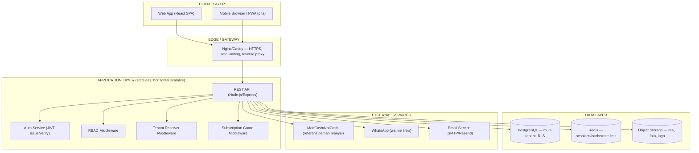
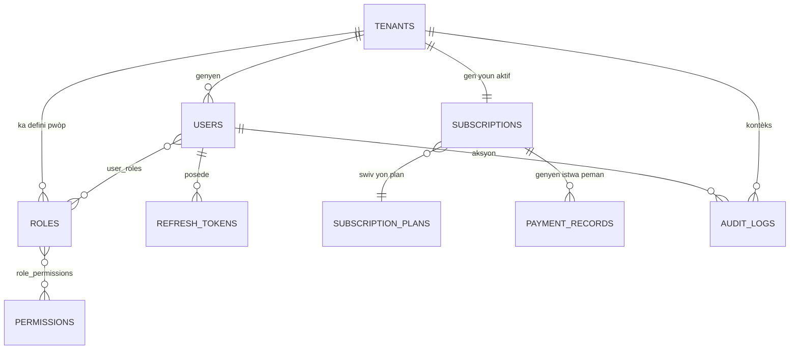

# LEADS STOCKPRO PREMIUM — Architecture Technique Final
### Phase 0 (Analiz Kritik) + Phase 1 (Architecture Foundation, Database Schema, Project Structure)

> Okenn kòd production pa ekri nan dokiman sa a. Objektif la se valide fondasyon an anvan implementation.

---

## PHASE 0 — ANALIZ KRITIK (obligatwa anvan kòd)

### 0.1 Kontèks aktyèl (sa mwen konnen sou travay StockPro/LeadStock jiskaprezan)

Pwojè anvan yo (LeadStock ERP, StockPro Tontin) se **single-file HTML apps**: localStorage oswa sql.js (SQLite WASM), backend Node/Express ak Basic Auth, hosting sou Termux+ngrok. Sa te bon pou yon sèl biznis, yon sèl itilizatè oswa yon ti gwoup fèmen.

**LEADS STOCKPRO PREMIUM** mande yon bagay diferan totalman: SaaS **multi-tenant**, plizyè biznis, plizyè itilizatè, RBAC, subscription, security production-grade, scalable. Sa se yon chanjman **architecture**, pa yon extension.

### 0.2 Kontradiksyon idantifye

| # | Kontradiksyon | Enplikasyon |
|---|---|---|
| C1 | Pattern "single-file HTML + localStorage" pa konpatib ak multi-tenant SaaS. localStorage se per-browser, pa gen isolation ant tenant, pa gen backend source of truth santralize. | Fòk nou abandone localStorage kòm source of truth. Li ka rete kòm cache/offline layer sèlman. |
| C2 | sql.js (SQLite WASM cote kliyan) pa ka sèvi kòm database production pou plizyè tenant k ap ekri an menm tan. Pa gen concurrency control, pa gen backup santralize, pa gen replication. | Bezwen yon vrè database server (PostgreSQL rekòmande — gade seksyon 1.2). |
| C3 | Hosting sou Termux/ngrok se yon solisyon devlopman/demo, li pa gen uptime garanti, pa gen SLA, IP/URL chanje souvan. Yon SaaS commercial pa ka repoze sou sa. | Bezwen yon vrè cloud host (VPS oswa PaaS). |
| C4 | Basic Auth (username:password sou chak requête, san token expiration, san refresh) pa yon architecture auth ki apwopriye pou yon platfòm multi-tenant ak plizyè wòl. | Ranplase ak JWT (access + refresh token) oswa session-based auth ak proper hashing (bcrypt/argon2). |
| C5 | "Subscription architecture" mande yon fason kolekte lajan rekiran. MonCash ak NatCash **pa gen API recurring billing/subscription otomatik** disponib piblikman jodi a — se peman manyèl/API transaksyon sèlman. | Fòk subscription lan modelize kòm "manual renewal + grace period + admin verification", pa "auto-charge" tankou Stripe. Sa se yon **missing requirement kritik** ki dwe rezoud anvan design database subscription (gade 0.4). |

### 0.3 Risk prensipal yo

1. **Risk teknik — Multi-tenant data leakage**: si isolation ant tenant pa fèt kòrèkteman (nan chak requête, chak query), yon biznis ka wè done yon lòt biznis. Sa se risk #1 nan tout SaaS multi-tenant.
2. **Risk teknik — Migration done ekzistan**: si gen done deja nan LeadStock ERP (localStorage/sql.js) pou kliyan aktyèl yo, pa gen yon plan migration ki idantifye jodi a.
3. **Risk operasyonèl — Peman/Subscription san gateway otomatik**: si w depann de verifikasyon manyèl MonCash/NatCash, gen risk erè imen, delè, ak fraud (moun ki di yo peye men yo pa peye).
4. **Risk security — Single point of failure**: si tout tenant yo nan yon sèl database san backup/replication, yon sèl pwoblèm ka afekte tout kliyan yo an menm tan (contrèman ak apwòch aktyèl kote chak enstans endepandan).
5. **Risk scope creep**: lis 14 pwen yo (auth, RBAC, subscription, API, security, deployment, testing...) se yon veritab pwodwi SaaS. Si ekip la se yon sèl moun (oswa yon ti ekip), gen risk **over-engineering** pou Phase 1 — bati yon architecture ki twò konplike pou nivo resous ki disponib.
6. **Risk maintainability**: san separation kòd fwontyè (frontend) / backend / database byen defini (kontrèman ak single-file HTML), ekip la ap bezwen chanje workflow devlopman li nèt.

### 0.4 Missing requirements (kesyon ki dwe reponn anvan implementation)

Sa yo se **blocker** — yo dwe klarifye anvan nou fikse schema/architecture final la:

1. **Echèl** : konbyen tenant (biznis) yo prevwa nan 6 mwa / 1 an? 10? 100? 10,000? Sa chanje chwa infrastructure.
2. **Modèl tarifikasyon**: gen konbyen plan (Free/Basic/Premium)? Peman se pou tout enstans nan yon biznis (per-tenant) oswa per-user?
3. **Peman rekiran**: èske w vle entegre yon gateway ki gen API reyèl (Stripe pa disponib fasil an Ayiti; gen opsyon tankou peman manyèl + validation admin, oswa yon third-party ki sipòte MonCash/NatCash API si genyen)?
4. **Offline-first oswa online-only?** LeadStock ERP te gen yon avantaj: li te ka fonksyone san entènèt. Èske LEADS STOCKPRO PREMIUM dwe konsève kapasite sa a (PWA + sync), oswa li vin yon app 100% online?
5. **Migration done ekzistan**: èske done LeadStock ERP aktyèl yo (kliyan, pwodwi, tranzaksyon) dwe enpòte nan nouvo sistèm lan?
6. **Idantite branding**: LEADS STOCKPRO PREMIUM — se yon pwodwi separe de LeadStock ERP, oswa se vèsyon "sou lekti" (upgrade) li?
7. **Ekip devlopman**: konbyen moun ap travay sou sa? Sa detèmine si nou bezwen monorepo simple oswa microservices.
8. **Deployment budget**: VPS (Hetzner/DigitalOcean/Contabo), PaaS (Railway/Render), oswa gen yon preferans deja?

> **Rekòmandasyon**: pou Phase 1, mwen ap pwopoze yon architecture ki **reponn** a kesyon sa yo ak yon defo rezonab (pragmatic, pa over-engineered), epi ki eksplisitman **evolutif** — chak chwa gen yon "chemen upgrade" pou lè echèl la grandi. Kote yon repons ou ta bay ta chanje architecture a fondamantalman (egzanp: 10,000 tenant vs 50 tenant), mwen make sa aklè pou w ka konfime oswa ajiste.

### 0.5 Korije — Prensip direktè Phase 1

Kòm korije pou kontradiksyon yo, Phase 1 chwazi:

- **Database**: PostgreSQL (pa sql.js/SQLite) — bezwen concurrency, foreign keys solid, row-level security pou multi-tenant.
- **Multi-tenancy**: **Shared database, shared schema, ak `tenant_id` sou chak tabl** + PostgreSQL Row-Level Security (RLS) kòm dezyèm kouch defans. (Pa schema-per-tenant, pa database-per-tenant — twò lou pou echèl inisyal, men chemen migration rete posib pi devan pou "gwo" tenant ki ta bezwen isolation fizik.)
- **Backend**: API REST santralize (Node.js/Express oswa Fastify), stateless, ak JWT.
- **Frontend**: rete web-first (React), men achitekti separe kle pou pèmèt PWA/offline pita san reekri tout bagay.
- **Subscription**: modèl **"manual-first, automatable pita"** — MonCash/NatCash referans manyèl + statut `pending_verification` → `active`, ak wòl Admin StockPro ki apwouve.
- **Hosting**: VPS Linux (pa Termux/ngrok) ak reverse proxy (Nginx/Caddy) + HTTPS reyèl (Let's Encrypt).

---

## PHASE 1 — ARCHITECTURE FOUNDATION

## 1. Architecture Diagram



**Prensip kle**: chak requête antre nan API a dwe pase pa **Tenant Resolver** (idantifye ki tenant) → **Auth** (ki moun) → **RBAC** (ki dwa) → **Subscription Guard** (èske abònman aktif) anvan li rive nan lojik biznis la. Se lòd sa a ki anpeche data leakage (Risk #1 nan 0.3).

---

## 2. Recommended Technology Stack

| Kouch | Chwa | Rezon |
|---|---|---|
| Frontend | React + Vite + TailwindCSS | Ekosistèm solid, konpatib ak branding StockPro (Fraunces/Inter/JetBrains Mono) |
| State/data fetching | TanStack Query | Cache, retry, sync ak API otomatik |
| Backend API | Node.js + Express (oswa Fastify si w vle pèfòmans) | Kontinwite ak eksperyans ekzistan (Node) |
| ORM/Query builder | Prisma oswa Drizzle ORM | Type-safety, migration files, byen dokimante |
| Database | PostgreSQL 16+ | Multi-tenant RLS, JSONB, transaction solid |
| Cache/Session | Redis | Rate-limiting, blacklist token, cache subscription status |
| Object storage | S3-compatible (Backblaze B2, Wasabi, oswa DigitalOcean Spaces — pi bon mache pase AWS S3) | Foto pwodwi, logo, resi PDF |
| Auth | JWT (access 15min + refresh 7j) + bcrypt/argon2 pou password | Stateless, scalable |
| PDF generation | Server-side (pdf-lib oswa Puppeteer) | Pou resi/rapò ki dwe idantik pou tout kliyan |
| Deployment | Docker + Docker Compose → VPS (Hetzner/Contabo) | Pòtabilite, pa depann de Termux/ngrok |
| Reverse proxy | Caddy (HTTPS otomatik) oswa Nginx | Production-grade TLS |
| Monitoring | Uptime Kuma (self-hosted, gratis) + logs (Pino) | Vizibilite san gwo depans |
| CI/CD | GitHub Actions | Automatize test + deploy |

> **Nòt**: chak eleman nan tablo sa a chwazi pou li **gratis oswa bon mache**, ki reflete kontèks biznis Ayisyen an — pa gen sèvis peye ki obligatwa pou demare.

---

## 3. Project Structure

```
leads-stockpro-premium/
├── apps/
│   ├── web/                       # Frontend React
│   │   ├── src/
│   │   │   ├── features/          # Yon dosye pa domèn (stock, vann, tenant, auth...)
│   │   │   ├── shared/            # Composants, hooks, utils komen
│   │   │   ├── lib/api-client.ts  # Wrapper axios/fetch ak auto-refresh token
│   │   │   └── app/               # Routing, providers, layout
│   │   └── vite.config.ts
│   │
│   └── api/                       # Backend Express/Fastify
│       ├── src/
│       │   ├── modules/
│       │   │   ├── auth/
│       │   │   ├── tenants/
│       │   │   ├── users/
│       │   │   ├── rbac/
│       │   │   ├── subscriptions/
│       │   │   ├── billing/
│       │   │   └── (pita: stock, sales...)
│       │   ├── middleware/
│       │   │   ├── tenant-resolver.ts
│       │   │   ├── auth.ts
│       │   │   ├── rbac.ts
│       │   │   └── subscription-guard.ts
│       │   ├── db/
│       │   │   ├── schema/        # Prisma/Drizzle schema files
│       │   │   └── migrations/
│       │   ├── lib/
│       │   └── server.ts
│       └── package.json
│
├── packages/
│   ├── shared-types/               # Type TypeScript pataje ant web ak api
│   └── config/                     # ESLint, tsconfig pataje
│
├── infra/
│   ├── docker-compose.yml
│   ├── Dockerfile.api
│   ├── Dockerfile.web
│   └── Caddyfile
│
├── docs/
│   └── LEADS-STOCKPRO-PREMIUM-Architecture-v1.md   # dokiman sa a
│
└── .github/workflows/ci.yml
```

**Rezon monorepo**: yon sèl repo ak `apps/` + `packages/` pèmèt pataje type ant frontend/backend san duplication, epi li rete senp pou yon ti ekip jere (pa bezwen microservices/multi-repo pou echèl inisyal la — gade 0.4 pwen 7).

---

## 4. Multi-Tenant Strategy

**Chwa: Shared Database, Shared Schema, `tenant_id` + Row-Level Security (RLS)**

| Apwòch | Avantaj | Dezavantaj | Vèdik |
|---|---|---|---|
| Database-per-tenant | Isolation total | Operasyonèlman lou (migration x N tenant), chè | ❌ Twò lou pou demare |
| Schema-per-tenant | Bon isolation | Konplike pou CI/CD, limit PostgreSQL sou anpil schema | ❌ Pa nesesè kounye a |
| **Shared schema + tenant_id + RLS** | **Senp, ekonomik, ka evolye** | Mande disiplin nan chak query | ✅ **Chwazi** |

**Mekanis konkrè**:
1. Chak tabl "tenant-scoped" gen yon kolòn `tenant_id UUID NOT NULL`.
2. PostgreSQL RLS **policy** aplike sou chak tabl: `USING (tenant_id = current_setting('app.current_tenant')::uuid)`.
3. Nan chak requête API, `tenant-resolver` middleware idantifye tenant la (soti nan subdomain, JWT claim, oswa header) epi li fikse `SET app.current_tenant = '<uuid>'` sou konneksyon PostgreSQL la anvan chak query.
4. **Rezilta**: menm si gen yon bug nan kòd application (yon developer bliye filtre `WHERE tenant_id = ...`), PostgreSQL li menm **refize** montre done lòt tenant — se yon dezyèm kouch defans kont Risk #1.

**Chemen evolisyon**: si yon tenant vin twò gwo (anpil trafik/done), li ka "gradye" pita nan yon database dedye san chanje API/schema — se yon detay konfigirasyon enfrastrikti, pa yon reekriti.

---

## 5. Database Schema Initial

```sql
-- ============ TENANCY & IDENTITY ============

CREATE TABLE tenants (
    id              UUID PRIMARY KEY DEFAULT gen_random_uuid(),
    business_name   TEXT NOT NULL,
    slug            TEXT UNIQUE NOT NULL,       -- pou subdomain/URL
    status          TEXT NOT NULL DEFAULT 'trial', -- trial | active | suspended | cancelled
    created_at      TIMESTAMPTZ NOT NULL DEFAULT now(),
    updated_at      TIMESTAMPTZ NOT NULL DEFAULT now()
);

CREATE TABLE users (
    id              UUID PRIMARY KEY DEFAULT gen_random_uuid(),
    tenant_id       UUID NOT NULL REFERENCES tenants(id) ON DELETE CASCADE,
    email           TEXT NOT NULL,
    phone           TEXT,
    password_hash   TEXT NOT NULL,
    full_name       TEXT NOT NULL,
    status          TEXT NOT NULL DEFAULT 'active', -- active | disabled
    last_login_at   TIMESTAMPTZ,
    created_at      TIMESTAMPTZ NOT NULL DEFAULT now(),
    UNIQUE(tenant_id, email)
);

-- ============ RBAC ============

CREATE TABLE roles (
    id              UUID PRIMARY KEY DEFAULT gen_random_uuid(),
    tenant_id       UUID REFERENCES tenants(id) ON DELETE CASCADE, -- NULL = system role (Admin/Anplwaye default)
    name            TEXT NOT NULL,             -- 'Admin', 'Anplwaye', 'Manager'...
    is_system_role  BOOLEAN NOT NULL DEFAULT false
);

CREATE TABLE permissions (
    id              UUID PRIMARY KEY DEFAULT gen_random_uuid(),
    code            TEXT UNIQUE NOT NULL       -- 'stock.write', 'sales.read', 'billing.manage'...
);

CREATE TABLE role_permissions (
    role_id         UUID NOT NULL REFERENCES roles(id) ON DELETE CASCADE,
    permission_id   UUID NOT NULL REFERENCES permissions(id) ON DELETE CASCADE,
    PRIMARY KEY (role_id, permission_id)
);

CREATE TABLE user_roles (
    user_id         UUID NOT NULL REFERENCES users(id) ON DELETE CASCADE,
    role_id         UUID NOT NULL REFERENCES roles(id) ON DELETE CASCADE,
    PRIMARY KEY (user_id, role_id)
);

-- ============ AUTH ============

CREATE TABLE refresh_tokens (
    id              UUID PRIMARY KEY DEFAULT gen_random_uuid(),
    user_id         UUID NOT NULL REFERENCES users(id) ON DELETE CASCADE,
    token_hash      TEXT NOT NULL,
    expires_at      TIMESTAMPTZ NOT NULL,
    revoked_at      TIMESTAMPTZ,
    created_at      TIMESTAMPTZ NOT NULL DEFAULT now()
);

-- ============ SUBSCRIPTION ============

CREATE TABLE subscription_plans (
    id              UUID PRIMARY KEY DEFAULT gen_random_uuid(),
    name            TEXT NOT NULL,             -- 'Free', 'Basic', 'Premium'
    price_htg       NUMERIC(12,2) NOT NULL,
    billing_cycle   TEXT NOT NULL,             -- 'monthly' | 'yearly'
    features        JSONB NOT NULL DEFAULT '{}'
);

CREATE TABLE subscriptions (
    id                  UUID PRIMARY KEY DEFAULT gen_random_uuid(),
    tenant_id           UUID NOT NULL REFERENCES tenants(id) ON DELETE CASCADE,
    plan_id             UUID NOT NULL REFERENCES subscription_plans(id),
    status              TEXT NOT NULL DEFAULT 'trial', -- trial | pending_verification | active | past_due | cancelled
    current_period_start TIMESTAMPTZ NOT NULL,
    current_period_end   TIMESTAMPTZ NOT NULL,
    created_at          TIMESTAMPTZ NOT NULL DEFAULT now()
);

CREATE TABLE payment_records (
    id              UUID PRIMARY KEY DEFAULT gen_random_uuid(),
    tenant_id       UUID NOT NULL REFERENCES tenants(id) ON DELETE CASCADE,
    subscription_id UUID NOT NULL REFERENCES subscriptions(id) ON DELETE CASCADE,
    method          TEXT NOT NULL,             -- 'moncash' | 'natcash' | 'cash' | 'other'
    reference_code  TEXT,                      -- referans transaksyon MonCash/NatCash
    amount_htg      NUMERIC(12,2) NOT NULL,
    status          TEXT NOT NULL DEFAULT 'pending', -- pending | verified | rejected
    verified_by     UUID REFERENCES users(id), -- Admin StockPro ki verifye
    verified_at     TIMESTAMPTZ,
    created_at      TIMESTAMPTZ NOT NULL DEFAULT now()
);

-- ============ AUDIT ============

CREATE TABLE audit_logs (
    id              UUID PRIMARY KEY DEFAULT gen_random_uuid(),
    tenant_id       UUID REFERENCES tenants(id) ON DELETE CASCADE,
    user_id         UUID REFERENCES users(id),
    action          TEXT NOT NULL,
    entity          TEXT,
    entity_id       UUID,
    metadata        JSONB,
    created_at      TIMESTAMPTZ NOT NULL DEFAULT now()
);

-- ============ ROW LEVEL SECURITY (egzanp) ============
ALTER TABLE users ENABLE ROW LEVEL SECURITY;
CREATE POLICY tenant_isolation_users ON users
    USING (tenant_id = current_setting('app.current_tenant', true)::uuid);
-- (menm pattern nan repete sou chak tabl tenant-scoped)
```

> Modil biznis yo (Stock, Vann, Kliyan, Finans...) yo **pa** enkli nan Phase 1 dapre demand ou a — yo ap vini nan yon Phase 2 apre validation fondasyon sa a, men chak tabl fiti ap swiv menm pattern `tenant_id + RLS`.

---

## 6. Entity Relationships



---

## 7. Authentication Architecture

- **Login**: email + password → verifye `password_hash` (argon2) → si OK, jenere **access token** JWT (15 min, kontni `user_id`, `tenant_id`, `roles`) + **refresh token** (7 jou, stoke hash li nan `refresh_tokens`, pa JWT — pou ka revoke).
- **Refresh flow**: client voye refresh token → sèvè verifye li pa revoke/ekspire → jenere nouvo access token (rotation refresh token pou anpeche replay).
- **Logout**: revoke refresh token nan DB.
- **Multi-tenant login**: si yon email ka egziste nan plizyè tenant (biznis diferan), login flow dwe mande tenant (via subdomain oswa yon seleksyon biznis apre login si yon moun gen aksè plizyè biznis).
- **Password policy**: min 8 karaktè, hash argon2id, rate-limit login (5 tantativ / 15 min via Redis) pou bloke brute-force.
- **2FA**: pa obligatwa Phase 1, men schema `users` ap prevwa yon kolòn `mfa_secret` (nullable) pou pa bezwen migration destriktif pita.

---

## 8. RBAC Architecture

- **Modèl**: Role-Based, ak **permission granulè** (pa jis "Admin/Anplwaye" fiks — sa se orijin StockPro, men RBAC la dwe pèmèt tenant kreye wòl pèsonalize pita).
- **System roles** (default pou chak nouvo tenant): `Owner` (tout dwa + jere abònman), `Admin` (jesyon biznis, pa ka touche billing), `Employee` (operasyon chak jou selon permission bay li).
- **Verifikasyon**: middleware `rbac.ts` chèk si `user.permissions` kontni `code` ki nesesè pou wout la (egzanp `subscription.manage`, `users.invite`), pa jis non wòl la — sa pèmèt granularite san chanje kòd pita.
- **Isolation**: yon wòl **pa janm** travèse tenant — `roles.tenant_id` garanti sa (eksepte system roles ki gen `tenant_id = NULL` epi yo clone pou chak tenant lè li kreye).

---

## 9. Subscription Architecture

Modèl **"manual-first"** dapre korije 0.5 (pa gen recurring auto-charge disponib ak MonCash/NatCash jodi a):

1. Tenant enskri → `subscriptions.status = 'trial'` (egzanp 14 jou gratis).
2. Anvan trial fini, tenant chwazi yon plan → li fè peman via MonCash/NatCash → li antre **referans transaksyon** nan app la → yon `payment_records` row kreye ak `status = 'pending'`.
3. Yon Admin StockPro (backoffice) verifye referans lan manyèlman (oswa otomatize pita si MonCash ofri yon API verifikasyon) → li chanje `status = 'verified'` → `subscriptions.status = 'active'`, `current_period_end` mete ajou.
4. Yon **scheduled job** (cron, chak jou) chèk `subscriptions` kote `current_period_end < now()` → chanje status pou `past_due` → apre yon grace period (egzanp 5 jou), `suspended` (aksè li limite men done pa efase).
5. **Subscription Guard middleware** verifye `subscriptions.status IN ('trial','active')` anvan otorize aksè a fonksyon peye yo.

**Evolisyon**: si yon jou gen yon API otomatik disponib (oswa w chwazi entegre yon pwosesè kat kredi entènasyonal), sèl bagay ki chanje se **etap 2-3** (kolekte peman) — schema/status machine an rete idantik.

---

## 10. API Architecture

- **Style**: REST, versionne (`/api/v1/...`), JSON.
- **Konvansyon**: `GET/POST/PATCH/DELETE /api/v1/{resource}`, pagination cursor-based pou lis (`?cursor=...&limit=...`).
- **Kouch middleware nan lòd** (chak requête): `tenant-resolver` → `auth` → `rbac` → `subscription-guard` → `handler`.
- **Erreur**: fòma estanda `{ "error": { "code": "...", "message": "..." } }`, HTTP status kòrèk (400/401/403/404/409/422/500).
- **Idempotency**: pou endpoint peman/kreyasyon kritik, sipòte `Idempotency-Key` header pou evite duplication si retry.
- **Rate limiting**: global (per IP) + per tenant (via Redis) pou anpeche yon tenant sèl konsome tout resous sèvè a.

---

## 11. Security Model

| Domèn | Mezi |
|---|---|
| Transport | HTTPS obligatwa tout kote (Caddy/Let's Encrypt), HSTS |
| Password | argon2id hash, pa janm log/stoke plain text |
| Tokens | JWT sign ak sekrè fò (rotation posib), refresh token revocable, courte durée access token |
| Multi-tenant isolation | `tenant_id` + PostgreSQL RLS (dezyèm kouch, endepandan de bug application) |
| Input validation | Validation strikt (Zod/Joi) sou chak endpoint, sanitization kont SQL injection (ORM paramétré) ak XSS |
| Secrets | `.env` + secret manager (pa janm commit nan git), rotation regilye |
| Audit | `audit_logs` pou tout aksyon sensib (chanjman wòl, peman, sispansyon kont) |
| Backup | Backup PostgreSQL otomatik chak jou (pg_dump → object storage), test restore regilye |
| Least privilege | Chak wòl/permission granulè, pa gen "super admin cross-tenant" eksepte yon wòl operasyon StockPro dedye (separe de wòl biznis kliyan yo) |
| Dependency | `npm audit`/Dependabot aktive nan CI |

---

## 12. Development Roadmap

| Faz | Kontni | Objektif |
|---|---|---|
| **Phase 1 (aktyèl)** | Architecture, DB schema, project structure, auth, RBAC, subscription skeleton | Fondasyon valide, san modil biznis |
| **Phase 2** | Tenant onboarding flow, admin backoffice (verifikasyon peman), invitation itilizatè | SaaS operasyonèl pou premye tenant peyan |
| **Phase 3** | Modil Stock (inventory) — migrasyon lojik LeadStock ERP nan nouvo architecture multi-tenant | Premye modil biznis |
| **Phase 4** | Modil Vann/Invoicing (twa mòd peman Kach/Dedwi/Depo, resi PDF, WhatsApp) | Fonksyonalite kle biznis |
| **Phase 5** | Modil Finans/Depans, rapò, dashboard | Konplete sik operasyon |
| **Phase 6** | PWA/offline sync (si konfime nan 0.4 pwen 4), optimizasyon pèfòmans, monitoring avanse | Rezistans ak mobilite |
| **Continu** | Testing, security review, feedback kliyan | Kalite ak stabilite |

---

## 13. Deployment Architecture

```
Internet → DNS (sous-domèn per-tenant opsyonèl: {tenant}.leadsstockpro.com)
        → Caddy (HTTPS otomatik, reverse proxy)
        → Docker network:
            ├── api container (Node.js, plizyè replika dèyè load balancer si bezwen)
            ├── web container (build statik React, sèvi via Caddy/Nginx)
            ├── postgres container (oswa managed DB pita)
            └── redis container
        → Object storage (eksteryè, S3-compatible)
        → Backup job (cron container oswa systemd timer sou host)
```

- **Anviwònman**: `development` (lokal Docker Compose) → `staging` (VPS ti gwosè) → `production` (VPS ki adapte ak echèl reyèl, ak monitoring).
- **CI/CD**: push sou `main` → GitHub Actions ranje: lint → test → build image Docker → deploy sou staging → deploy manyèl/otomatik sou production apre validation.
- **Zero-downtime**: rolling deploy (Docker Compose ak `--no-deps` oswa pita migrasyon vè Docker Swarm/K8s si echèl mande sa — pa nesesè Phase 1).

---

## 14. Testing Strategy

| Nivo | Zouti | Kouvèti |
|---|---|---|
| Unit | Vitest/Jest | Lojik biznis pi (RBAC checks, subscription state machine, kalkil) |
| Integration | Supertest + DB test conteneurizé | Endpoint API konplè, ak middleware chain (tenant/auth/rbac) |
| Multi-tenant isolation test | Test dedye | **Obligatwa**: kreye 2 tenant fiktif, verifye tenant A pa ka janm li/ekri done tenant B — sa se test ki pi enpòtan nan tout suite a |
| E2E | Playwright | Flow kritik: enskripsyon, login, peman/verifikasyon, chanjman wòl |
| Security | `npm audit`, dependency scan, manyèl pentest ba (OWASP top 10 checklist) anvan lansman piblik | Anvan chak release majè |
| Load (pita, Phase 2+) | k6 oswa Artillery | Verifye konpòtman anba chaj plizyè tenant simultane |

---

## 15. Risk Assessment (final, aprè korije)

| Risk | Severite | Mitigation nan architecture sa a |
|---|---|---|
| Data leakage ant tenant | Kritik | `tenant_id` + RLS (dezyèm kouch), test dedye obligatwa |
| Peman fo/erè manyèl | Mwayen-elve | `payment_records` ak `verified_by`/`verified_at`, audit log, grace period anvan sispansyon |
| Migration done LeadStock ekzistan | Mwayen (depann repons 0.4.5) | Pa adrese Phase 1 — mande yon script migration dedye lè repons konfime |
| Over-engineering pou ti echèl | Mwayen | Stack chwazi rete senp/bon mache, monorepo, pa microservices |
| Single VPS = single point of failure | Mwayen | Backup jounalye + plan restore; upgrade vè managed DB/multi-instance se yon chemen posib, pa yon blocker Phase 1 |
| Depandans MonCash/NatCash pou revni | Elve (biznis) | Modèl subscription pa depann de yon API oswa gateway espesifik — fasil chanje/ajoute lòt metòd peman |
| Ekip ti gwosè pa ka mentni konpleksite | Mwayen | Rekòmandasyon: Phase 1-2 sèlman anvan nenpòt modil biznis — evite paralèl work ki ta mennen nan enkoyerans |

---

## Konklizyon — Sa ki bezwen konfime anvan Phase 1 kòmanse an vre

Anvan nenpòt kòd ekri (menm skeleton), 3 repons yo ki ta chanje architecture a **fondamantalman** si yo diferan de sa mwen sipoze a:

1. Echèl tenant vize (pou konfime chwa "shared DB + RLS" la rete bon).
2. Modèl subscription "manual-first" konfime (pa gen API recurring otomatik disponib).
3. Offline/PWA se yon egzijans Phase 1 oswa li ka ranvwaye (afekte chwa frontend architecture).

Yon fwa sa yo konfime (oswa ajiste), Phase 1 kòmanse ak: setup monorepo → schema migration files (Prisma/Drizzle) → auth + RBAC + subscription skeleton, **san okenn modil Stock/Vann**.
